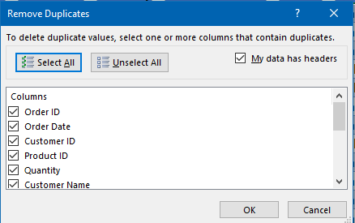
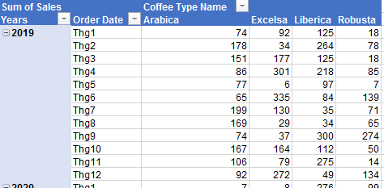
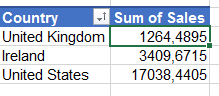
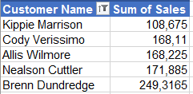
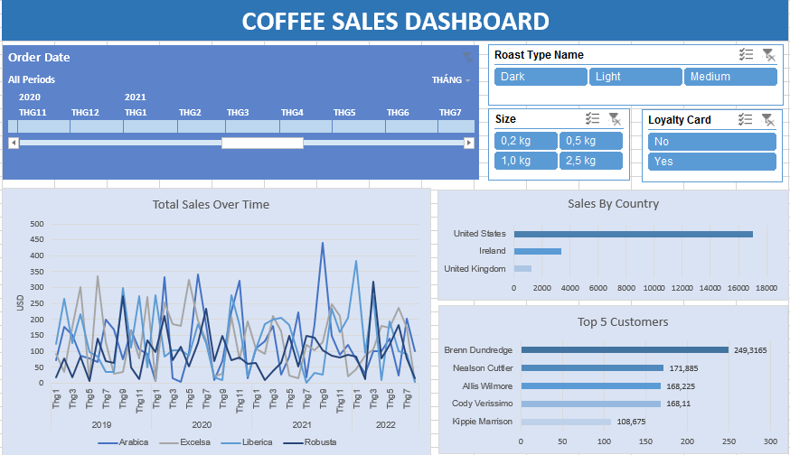

# Excel_Project_Coffee_Sales_Dashboard
### ☕ Introduction

This project demonstrates how to build a dynamic sales dashboard in Excel using a sample dataset of coffee sales across different markets, products, and time periods. Designed to simulate a real-world business scenario, the dashboard helps users track trends, customer behavior, and country-level sales performance. The goal is to deliver insights that can guide marketing and product decisions through data storytelling.

- 📊 My final dashboard is in [Coffee_Sales_Dashboard](Excel_Project_Coffee_Sales_Dashboard.xlsx)


---

### 🛠️ Excel Skills Used
The following Excel skills were utilized for analysis:
- **Pivot Tables & Pivot Charts**
- **Slicers & Timelines**
- **Formulas and Functions**

---
### 📊 Coffee Sales Dataset

The dataset used for this project consists of three tables: `Customers`, `Products`, and `Orders`. The data was sourced from an Excel course and provides a hands-on foundation for practicing dashboard design and sales reporting.
It includes detailed information from:

- 👨  **Customers Table**  
  - Customer IDs  
  - Country and region  
  - Loyalty card status  

- ☕ **Products Table**  
  - Product IDs  
  - Roast type (Light, Medium, Dark)  
  - Size (e.g., 1.0kg, 2.5kg)  
  - Pricing information  

- 📦 **Orders Table**  
  - Order dates  
  - Quantity and total sales  
  - Links to customer and product IDs for analysis  

### 1️⃣ Data Cleaning

To prepare the data for analysis, several cleaning and transformation steps were performed:

- 🔗 **Used `LOOKUP` and `INDEX MATCH`**  
  - Pulled product and customer information into the `Orders` table using functions like `INDEX(MATCH())`  
 

```
=IF((VLOOKUP(C2;customers!A1:C1001;3;FALSE)<>0);VLOOKUP(C2;customers!A1:C1001;3;FALSE);"")
```
```
=INDEX(products!$A$1:$G$49;MATCH(orders!$D2;products!$A$1:$A$49;0);MATCH(orders!I$1;products!$A$1:$G$1;0))
```
 

- 📉  **Formatted data types**  
  - Converted dates to consistent format  
  - Formatted currency fields for better readability

- 🗑️ **Removed duplicates**  
  - Cleaned duplicate entries to avoid misleading analysis 



---

### 2️⃣ Data Analysis with Pivot Tables

With clean data, pivot tables were used to summarize and analyze key metrics:

- 📦 **Sales by Coffee Type Over Time**  
 


- 📈 **Sales analysis by Country**  



- 👥 **Top 5 Customers** 


---

### 3️⃣ Excel Dashboard

The final step was designing a **user-friendly dashboard** with dynamic, interactive features:

- 📉  **Built with Pivot Charts, Slicers, and Timelines**  
  - Integrated visual elements that respond to user selections  
  - Designed for intuitive filtering by roast type, size, loyalty status.


- 🔁 **Easy to navigate and update**  
  - Refreshes automatically when data is updated  
  - Clear layout for stakeholders or team members


 
---

### ✅ Conclusion

This project provided a hands-on experience in transforming raw sales data into actionable business insights. By integrating data from multiple tables and leveraging pivot tables, slicers, and charts, the final dashboard offers a clear, interactive view of coffee sales performance across countries, products, and time.

The dashboard also helps stakeholders quickly identify trends, top-performing segments, and areas for improvement.

---

### 🎓 Key Learnings

- ✅ **Data Cleaning Practice**  
  Learned how to use `INDEX MATCH` and `LOOKUP`, remove duplicates, and standardize data formats to prepare a clean dataset for analysis.

- ✅ **Pivot Tables and Charts**  
  Gained experience summarizing large datasets and extracting insights using dynamic pivot tables and charts.

- ✅ **Dashboard Design**  
  Developed skills in creating interactive Excel dashboards with slicers, timelines, and user-friendly layouts.

- ✅ **Storytelling with Data**  
  Improved ability to communicate findings clearly and visually through a well-designed report.

This project strengthened my Excel skills in both analysis and presentation—key abilities for any data-driven role.

---

